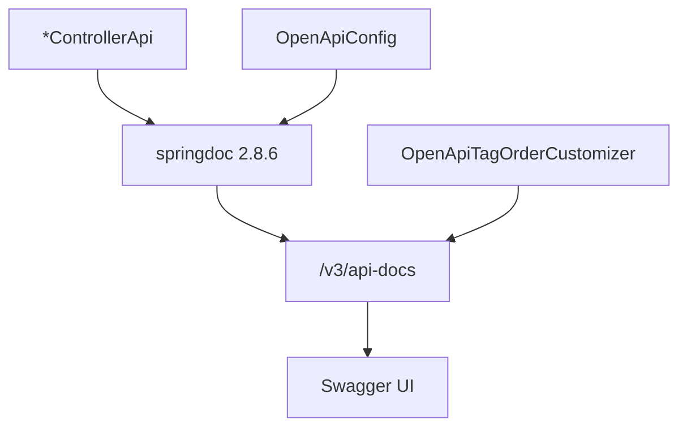

# API Docs Design

**Spec**: `.specs/features/api-docs/spec.md`
**Status**: Approved

---

## Architecture Overview

O documento OpenAPI continua gerado pelo springdoc 2.8.6 a partir das anotações. Cada controller passa a implementar uma interface `*Api` que carrega mapping, summary, description, exemplo de entrada e respostas. `OpenApiConfig` fica com o texto curto do produto. Um `GlobalOpenApiCustomizer` reescreve a lista `tags` na ordem do fluxo, porque o springdoc monta essa lista num `HashSet` e a ordem do bean se perde.

Três caminhos entregavam o mesmo Swagger. O escolhido é a interface por controller, já fechada na spec (DOCS-04) e em `context.md`. Um `openapi.yaml` manual duplicaria o contrato e apodreceria. Anotação direto no método enterraria o controller, que foi o que se quis evitar.

---

## Code Reuse Analysis

### Existing Components to Leverage

| Component | Location | How to Use |
| --------- | -------- | ---------- |
| AuthControllerApi | `auth/openapi/AuthControllerApi.java` | Modelo da interface: mapping e anotações nela, controller só implementa |
| OpenApiTags | `openapi/OpenApiTags.java` | Nomes estáveis. Ganha `BANK_STATEMENTS` |
| OpenApiSecuritySchemes | `openapi/OpenApiSecuritySchemes.java` | Scheme `Bearer Authentication` permanece |
| ApiValidationErrorResponse, ApiUnauthorizedResponse, ApiConflictResponse | `openapi/` | 400, 401 de login e 409 genérico. O 401 de login não vai para rota protegida |
| StandardError | `exception/standardexceptionerror/StandardError.java` | Schema dos erros JSON |
| AuthRequestDTO | `auth/dto/AuthRequestDTO.java` | Já exemplifica o seed de dev |
| SettlementLayout.RECONPAY | `externalsettlement/enums/SettlementLayout.java` | CSV mínimo da liquidação usa esse cabeçalho |
| BankStatementCsvParser | `bankstatement/service/BankStatementCsvParser.java` | CSV mínimo do extrato usa `lineReference,externalReference,amount,movementDate` |
| ReconciliationCsvExporter | `reconciliation/service/ReconciliationCsvExporter.java` | Exemplo do export usa o `HEADER` de lá |

### Integration Points

| System | Integration Method |
| ------ | ------------------ |
| Swagger UI | Mesmos paths `/v3/api-docs` e `/swagger-ui.html`. `tagsSorter` continua sem valor, para a UI não reordenar em alfabético |
| Segurança | `@SecurityRequirements` vazio só na interface de auth. As outras declaram `@SecurityRequirement(name = "Bearer Authentication")` |
| AD-001, AD-002, AD-003 | Intro cita ADMIN e OPERATOR. Descrições de register, verify-email e POST merchant continuam com conta inativa, link de e-mail e auto-grant |

---

## Components

### OpenApiConfig

- **Purpose**: Intro curta do produto e dos papéis, scheme bearer e o item de segurança global.
- **Location**: `config/OpenApiConfig.java`
- **Interfaces**: o bean `OpenAPI` deixa de ter a lista numerada de chamadas. O texto nomeia ADMIN e OPERATOR e não numera endpoints.
- **Dependencies**: `OpenApiSecuritySchemes`
- **Reuses**: o bean atual

### OpenApiTags

- **Purpose**: Nomes das nove tags, na ordem do fluxo.
- **Location**: `openapi/OpenApiTags.java`
- **Interfaces**: constantes atuais mais `BANK_STATEMENTS = "Bank Statements"`, e a lista ordenada que o customizer publica.
- **Dependencies**: nenhuma
- **Reuses**: as constantes já usadas por auth e sessão

### OpenApiTagOrderCustomizer

- **Purpose**: Gravar `openApi.tags` na ordem operacional, com description em português, depois que o springdoc mistura as tags.
- **Location**: `openapi/OpenApiTagOrderCustomizer.java`
- **Interfaces**:
  - `customise(OpenAPI openApi): void` como `GlobalOpenApiCustomizer`
- **Dependencies**: `OpenApiTags`
- **Reuses**: bean Spring, sem grupo extra de API

### Anotações de resposta

- **Purpose**: Um status, uma frase e um exemplo `StandardError` com `status` e `error` iguais ao código.
- **Location**: `openapi/`
- **Interfaces**:
  - `ApiValidationErrorResponse` permanece para 400 `VALIDATION_ERROR`
  - `ApiUnauthorizedResponse` permanece no login (credencial inválida ou conta inativa)
  - `ApiUnauthenticatedResponse` nova, 401 `UNAUTHORIZED`, frase de token ausente ou inválido, nas rotas protegidas
  - `ApiForbiddenResponse` nova, 403 `FORBIDDEN`
  - `ApiNotFoundResponse` nova, 404 `NOT_FOUND`
  - `ApiConflictResponse` permanece para 409 `CONFLICT`
  - `ApiPayloadTooLargeResponse` nova, 413 `VALIDATION_ERROR`, só nos dois imports
- **Dependencies**: `StandardError`
- **Reuses**: o formato das três anotações que já existem

O 409 dos imports de liquidação e extrato não usa a anotação genérica. A operação declara o exemplo com `details.conflictingReferences`. O 400 desses imports declara `details.rowErrors`.

### Interfaces de documentação

- **Purpose**: Summary, description, exemplo de request e respostas de cada operação.
- **Location**: uma interface por módulo, ao lado do controller: `auth/openapi/MeControllerApi.java`, `auth/openapi/UserControllerApi.java`, `merchant/openapi/MerchantControllerApi.java`, `feerule/openapi/FeeRuleControllerApi.java`, `transaction/openapi/TransactionControllerApi.java`, `externalsettlement/openapi/ExternalSettlementControllerApi.java`, `bankstatement/openapi/BankStatementControllerApi.java`, `reconciliation/openapi/ReconciliationControllerApi.java`. `AuthControllerApi` permanece e ganha os exemplos.
- **Interfaces**: a assinatura pública que o controller já tem, com `@RequestMapping` na interface. JSON de entrada leva `@ExampleObject` com todos os obrigatórios. Path param UUID leva example `3fa85f64-5717-4562-b3fc-2c963f66afa6`. Query própria da operação (`email`, `layout`, `importId`, `result`, `discrepancyType`) leva example. `page`, `size` e `sort` ficam para o customizer abaixo. Upload documenta a parte `file` e cola um CSV mínimo na description. Export declara 200 `text/csv` com a linha de cabeçalho. GET verify-email declara 200 e 400 `text/html`, sem `StandardError`. 204 só tem description.
- **Dependencies**: DTOs e anotações de resposta
- **Reuses**: `AuthControllerApi`

### ApiDocsParameterCustomizer

- **Purpose**: Exemplo nos parâmetros que o springdoc explode e a interface não possui como campos nossos.
- **Location**: `openapi/ApiDocsParameterCustomizer.java`
- **Interfaces**:
  - `customise(Operation operation, HandlerMethod handlerMethod): Operation`
  - `page` example `0`, `size` example `20`, `sort` example igual ao `@PageableDefault` do método quando existir
  - path param sem example e com schema string no formato de UUID recebe `3fa85f64-5717-4562-b3fc-2c963f66afa6` só se a interface ainda não pôs example
- **Dependencies**: springdoc `OperationCustomizer`
- **Reuses**: `default-flat-param-object: true` já ligado em `application.yaml`

### Controllers

- **Purpose**: Continuar o HTTP e a delegação, sem texto de documentação.
- **Location**: os nove `*Controller.java`
- **Interfaces**: cada um `implements` a interface do módulo. `@GetMapping` e os irmãos saem da classe e ficam na interface, como em `AuthController`. Nenhum método da classe carrega `@Operation`.
- **Dependencies**: o service que já injetam
- **Reuses**: o corpo dos métodos, sem mudança de status nem de payload

### ApiDocsIntegrationTest

- **Purpose**: Travar o documento gerado na tabela da spec.
- **Location**: `src/test/java/br/com/hanrry/reconpay/openapi/ApiDocsIntegrationTest.java`
- **Interfaces**: estende `AbstractIntegrationTest`, lê `/v3/api-docs` e confere ordem das tags, intro sem lista numerada, security vazio nas quatro rotas de auth, scheme bearer nas demais, códigos da tabela, exemplo JSON cujo `status` e `error` batem no erro, exemplo de request que passa na Bean Validation, login com o seed, 204 sem schema, HTML sem `StandardError`, CSV com o cabeçalho do exporter.
- **Dependencies**: MockMvc, `Validator`, contexto de teste com Postgres
- **Reuses**: `AbstractIntegrationTest`

Um teste de reflexão, sem Spring, confere que cada um dos nove controllers implementa uma interface `*Api` e que `@Operation` não está nos métodos da classe.

---

## Data Models

Não há modelo novo. Os exemplos descrevem os DTOs e o `StandardError` que já existem.

---

## Error Handling Strategy

| Error Scenario | Handling | User Impact |
| -------------- | -------- | ----------- |
| Status da tabela | Anotação compartilhada ou exemplo da operação, com a frase em português | O Swagger mostra o código, a frase e um JSON de exemplo |
| 500, optimistic lock, conflito genérico de integridade | Não entram por operação | O handler global continua respondendo; o Swagger não convida a testar isso |
| Upload sem arquivo pré-carregado | Description com o CSV mínimo e a parte `file` | A pessoa salva o texto e escolhe o arquivo no Try it out |
| UUID de exemplo inexistente | Example sintático e a description diz para usar o id da resposta anterior | O Try it out mostra o formato; o 404 é o código documentado |

---

## Risks & Concerns

| Concern | Location (file:line) | Impact | Mitigation |
| ------- | -------------------- | ------ | ---------- |
| `buildTags` guarda as tags num `HashSet` e devolve `new ArrayList<>(tags)` | springdoc `OpenAPIService.java` 2.8.6, métodos em torno das linhas 327 e 378 do fonte | A ordem em `/v3/api-docs` não segue o bean nem a descoberta dos controllers | `OpenApiTagOrderCustomizer` substitui a lista no fim |
| `tagsSorter` nulo preserva a ordem do documento; `alpha` a destrói | `AbstractSwaggerUiConfigProperties` campo `tagsSorter`, default nulo | UI alfabética quebra DOCS-01 | Não setar `springdoc.swagger-ui.tags-sorter` |
| 401 compartilhado fala "credenciais inválidas" | `openapi/ApiUnauthorizedResponse.java:20` | Rota protegida explicaria o erro errado | Anotação nova para token ausente ou inválido. A atual fica no login |
| Export é `void` e escreve no servlet | `reconciliation/controller/ReconciliationController.java:91` | springdoc pode publicar 200 sem `text/csv` | `@ApiResponse` explícito com o cabeçalho do exporter |
| Não existe teste do documento | `src/test` sem menção a `api-docs` | A tabela de códigos regride em silêncio | `ApiDocsIntegrationTest` no gate |
| Senha do seed no exemplo | `auth/dto/AuthRequestDTO.java` example `DevAdmin@2026` | O valor já está no README e só existe em dev/test | O exemplo repete o seed documentado. Produção não carrega esse usuário |
| Mapping duplicado se a classe e a interface declararem o verbo | `AuthController` já deixa o mapping só na interface | Rota registrada duas vezes | Mapping só na interface |

---

## Tech Decisions

| Decision | Choice | Rationale |
| -------- | ------ | --------- |
| Onde o texto mora | Interface `*Api` por controller | Fechado na spec. Vira convenção do projeto na aprovação deste desenho: endpoint novo documenta na interface, não no método |
| Ordem das tags | `GlobalOpenApiCustomizer` no documento pronto | O `HashSet` do springdoc 2.8.6 ignora a ordem do bean |
| Exemplo de JSON | `@ExampleObject` na operação | O teste lê um JSON só, sem remontar o schema |
| Exemplo de `page` / `size` / `sort` | `OperationCustomizer` | O `Pageable` não é nosso e o flat param não aceita `@Schema` no campo |
| 401 | Duas anotações | Login e rota sem token não são a mesma frase |
| HTTP 500 por operação | Fora | Já está na spec |

Na aprovação, registrar em `.specs/STATE.md` o AD-006: documentação OpenAPI de cada controller fica na interface `*Api` que ele implementa.
