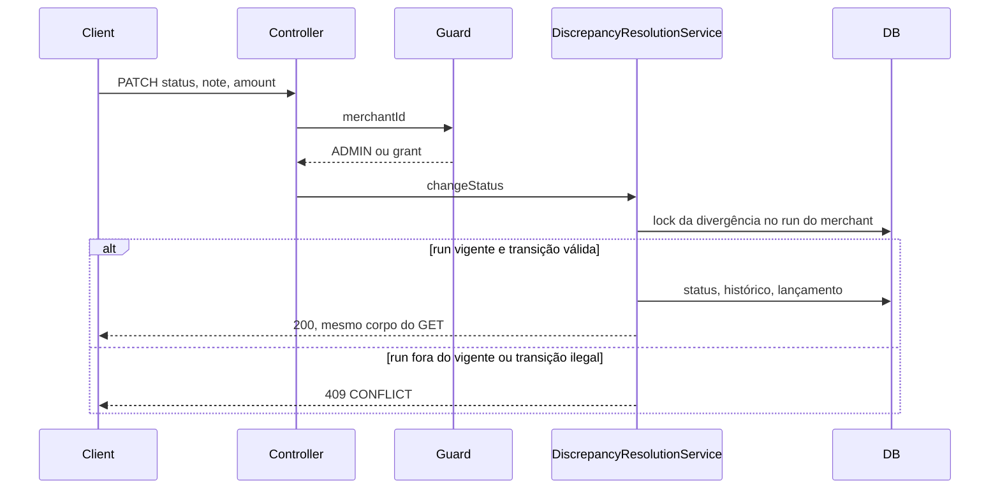

# Discrepancy Resolution Design

**Spec**: `.specs/features/discrepancy-resolution/spec.md`
**Status**: Approved

---

## Architecture Overview

O desfecho fica no módulo `reconciliation`. A divergência ganha status e versão. Lançamento e histórico ficam em tabelas filhas. Um serviço novo aplica a transição. O motor de batimento só marca `OPEN` ao criar a divergência. O `ReconciliationService` continua dono do run, da listagem e do CSV.

O guard de merchant já cobre o endpoint novo: o parâmetro se chama `merchantId`, e o matcher `/api/merchants/*/reconciliations/**` já exige `ADMIN` ou `OPERATOR`. ADMIN passa no guard sem linha em `user_merchants` (AD-001). Não há papel novo nem `owner_id` (AD-004).



---

## Code Reuse Analysis

### Existing Components to Leverage

| Component | Location | How to Use |
| --------- | -------- | ---------- |
| Merchant access aspect | `src/main/java/br/com/hanrry/reconpay/security/MerchantAccessAspect.java` | O PATCH e o GET ficam no controller que já tem `merchantId` |
| MerchantAccessGuard | `src/main/java/br/com/hanrry/reconpay/security/MerchantAccessGuard.java` | ADMIN libera; OPERATOR depende de `user_merchants` |
| SecurityConfig matcher | `src/main/java/br/com/hanrry/reconpay/config/SecurityConfig.java` | `PATH_RECONCILIATIONS` já cobre o subcaminho |
| AuditLogger | `src/main/java/br/com/hanrry/reconpay/observability/AuditLogger.java` | `record` só escreve depois do commit |
| Optimistic lock | `GlobalExceptionHandler` e `V17__transaction_optimistic_locking.sql` | `@Version` na divergência; o segundo save vira 409 |
| Not found | `ReconciliationNotFoundException` no handler de 404 | Nova exceção entra na mesma lista |
| Conflict handler | `GlobalExceptionHandler.handleConflict` | A transição ilegal entra aqui, não no handler de 400 |
| Partial unique index | `V3__create_feerules_table.sql` | Um lançamento ativo por divergência, `WHERE voided_at IS NULL` |
| Money digits | `CreateTransactionRequestDTO` | `@Digits(integer = 17, fraction = 2)` |
| MapStruct | `IReconciliationMapper` | A lista ganha `id` e `status`; o detalhe é outro DTO |
| CSV exporter | `ReconciliationCsvExporter` | Continua lendo só `type`. O cabeçalho não muda |

### Integration Points

| System | Integration Method |
| ------ | ------------------ |
| Run e item | A divergência já pertence ao item, e o item ao run. O serviço lê `status` e `supersededAt` por esse caminho |
| Transação interna | Nenhuma escrita. O teste compara o líquido e o status antes e depois |
| Motor | `ReconciliationEngine.discrepancy` define `OPEN`. O cálculo não lê lançamento nem histórico |
| Flyway | `V20__discrepancy_resolution.sql`. Linhas atuais nascem `OPEN` |

---

## Components

### Migration V20

- **Purpose**: Cria status, versão, histórico e lançamento, e impede dois lançamentos ativos.
- **Location**: `src/main/resources/db/migration/V20__discrepancy_resolution.sql`
- **Interfaces**: Sem API. Colunas e índices abaixo, em Data Models.
- **Dependencies**: Tabelas de `V9__create_reconciliation_tables.sql` e `users`.
- **Reuses**: Índice parcial no mesmo formato de `fee_rules`.

### DiscrepancyStatus

- **Purpose**: Os quatro status da API.
- **Location**: `src/main/java/br/com/hanrry/reconpay/reconciliation/enums/DiscrepancyStatus.java`
- **Interfaces**: `OPEN`, `ACCEPTED`, `ADJUSTED`, `WRITTEN_OFF`
- **Dependencies**: Nenhuma.
- **Reuses**: Enums de string do módulo.

### ReconciliationDiscrepancyEntity

- **Purpose**: Guarda o status atual e a versão do lock.
- **Location**: `src/main/java/br/com/hanrry/reconpay/reconciliation/entity/ReconciliationDiscrepancyEntity.java`
- **Interfaces**: `status`, `version`, coleções lazy de ajustes e transições.
- **Dependencies**: Item de conciliação.
- **Reuses**: A entidade atual. `@Version` igual ao de `InternalTransactionEntity`.

### DiscrepancyAdjustmentEntity

- **Purpose**: Um lançamento de correção, ativo ou anulado.
- **Location**: `src/main/java/br/com/hanrry/reconpay/reconciliation/entity/DiscrepancyAdjustmentEntity.java`
- **Interfaces**: `amount`, `createdBy`, `createdAt`, `voidedAt`
- **Dependencies**: Divergência e usuário ator.
- **Reuses**: `NUMERIC(19,2)` do restante do dinheiro.

### DiscrepancyTransitionEntity

- **Purpose**: Uma linha por mudança de status.
- **Location**: `src/main/java/br/com/hanrry/reconpay/reconciliation/entity/DiscrepancyTransitionEntity.java`
- **Interfaces**: `actorUserId`, `fromStatus`, `toStatus`, `note`, `createdAt`
- **Dependencies**: Divergência e usuário ator.
- **Reuses**: Nenhum histórico anterior. A criação da divergência não gera linha.

### DiscrepancyResolutionService

- **Purpose**: Aplica uma transição válida, ou devolve a divergência com histórico.
- **Location**: `src/main/java/br/com/hanrry/reconpay/reconciliation/service/DiscrepancyResolutionService.java`
- **Interfaces**:
  - `get(merchantId, runId, discrepancyId): DiscrepancyDetailResponseDTO`
  - `changeStatus(merchantId, runId, discrepancyId, request): DiscrepancyDetailResponseDTO`
- **Dependencies**: Repositório da divergência, `AuditLogger`, `CustomUserDetails` no `SecurityContext`.
- **Reuses**: `@Transactional` único em `changeStatus`. Falha no lançamento ou no histórico desfaz o status.

Regras de `changeStatus`, nesta ordem:

1. Carrega a divergência pelo id, pelo run e pelo merchant. Ausência: 404.
2. Se o run não está `COMPLETED` ou `supersededAt` não é nulo: 409, sem gravar.
3. Se o alvo é o status atual, ou ambos estão em `ACCEPTED`, `ADJUSTED`, `WRITTEN_OFF`: 409, sem gravar.
4. De `OPEN`, aceita `ACCEPTED`, `ADJUSTED`, `WRITTEN_OFF`. Desses três, aceita só `OPEN`.
5. Em `ADJUSTED`, cria o lançamento com o valor do pedido, o id do ator e o instante.
6. Em reabertura de `ADJUSTED`, preenche `voidedAt` do lançamento ativo. Sem lançamento ativo, a transação falha e o status não muda.
7. Acrescenta uma linha de histórico. Nota em branco ou só espaços vira null.
8. Chama `auditLogger.record("DISCREPANCY_STATUS_CHANGED", "discrepancy", id, from + " -> " + to)`.

O ator é `CustomUserDetails.getId()`. O corpo não traz usuário.

### Controller

- **Purpose**: Expõe GET e PATCH no caminho da spec.
- **Location**: `src/main/java/br/com/hanrry/reconpay/reconciliation/controller/ReconciliationController.java`
- **Interfaces**:
  - `GET /api/merchants/{merchantId}/reconciliations/{runId}/discrepancies/{discrepancyId}`
  - `PATCH` no mesmo caminho, corpo `UpdateDiscrepancyStatusRequestDTO`
- **Dependencies**: `DiscrepancyResolutionService`
- **Reuses**: O parâmetro `merchantId` para o aspect. Anotação de segurança já presente na classe.

### Request e validação

- **Purpose**: Rejeita nota e valor inválidos antes do serviço.
- **Location**: `src/main/java/br/com/hanrry/reconpay/reconciliation/dto/UpdateDiscrepancyStatusRequestDTO.java`
- **Interfaces**: `status` obrigatório, `note` opcional até 500, `correctionAmount` opcional no tipo, obrigatório na regra.
- **Dependencies**: Bean Validation.
- **Reuses**: `@Digits(integer = 17, fraction = 2)`. Um validador da classe rejeita zero, rejeita ausência quando o alvo é `ADJUSTED`, e rejeita presença quando o alvo é `ACCEPTED`, `WRITTEN_OFF` ou `OPEN`. Isso responde 400 `VALIDATION_ERROR`.

Valor com sinal passa em `@Digits`. `@DecimalMin` não serve: ele barraria a correção negativa.

### Resposta

- **Purpose**: A lista fica curta. O detalhe carrega o desfecho.
- **Location**: `DiscrepancyResponseDTO` e `DiscrepancyDetailResponseDTO` no pacote `reconciliation.dto`
- **Interfaces**:
  - Lista: os campos atuais mais `id` e `status`. Sem histórico e sem lançamento.
  - Detalhe: `id`, `type`, `expectedValue`, `actualValue`, `status`, ajustes (`amount`, `voided`) e histórico em ordem crescente de `createdAt` (ator, status anterior, status novo, nota, instante).
- **Dependencies**: MapStruct.
- **Reuses**: `toDiscrepancyDTO` para a lista. Método novo para o detalhe. PATCH 200 devolve esse detalhe.

### Exceções

- **Purpose**: 404 e 409 no formato `StandardError`.
- **Location**: `src/main/java/br/com/hanrry/reconpay/exception/`
- **Interfaces**:
  - `DiscrepancyNotFoundException` no handler de 404, junto de `ReconciliationNotFoundException`.
  - `DiscrepancyResolutionConflictException` no `handleConflict`, HTTP 409 `CONFLICT`.
- **Dependencies**: `GlobalExceptionHandler`.
- **Reuses**: `OptimisticLockingFailureException`, que já responde 409. A corrida de dois PATCH usa o `@Version`, sem versão no JSON.

### Motor

- **Purpose**: Toda divergência nova nasce `OPEN`, sem histórico.
- **Location**: `ReconciliationEngine.discrepancy`
- **Interfaces**: `entity.setStatus(DiscrepancyStatus.OPEN)`
- **Dependencies**: Enum novo.
- **Reuses**: O factory atual. O motor não lê ajuste nem transição.

---

## Data Models

### reconciliation_discrepancies

```text
status VARCHAR(30) NOT NULL DEFAULT 'OPEN'
version BIGINT NOT NULL DEFAULT 0
```

Linhas já gravadas recebem `OPEN` e `version` 0. Sem histórico retroativo.

### discrepancy_adjustments

```text
id UUID PK
discrepancy_id UUID NOT NULL FK reconciliation_discrepancies
amount NUMERIC(19,2) NOT NULL CHECK (amount <> 0)
created_by UUID NOT NULL FK users
created_at TIMESTAMP NOT NULL
voided_at TIMESTAMP NULL

UNIQUE (discrepancy_id) WHERE voided_at IS NULL
```

### discrepancy_transitions

```text
id UUID PK
discrepancy_id UUID NOT NULL FK reconciliation_discrepancies
actor_user_id UUID NOT NULL FK users
from_status VARCHAR(30) NOT NULL
to_status VARCHAR(30) NOT NULL
note VARCHAR(500) NULL
created_at TIMESTAMP NOT NULL
```

Índice em `(discrepancy_id, created_at)`.

**Relationships**: Uma divergência tem vários lançamentos e várias transições. No máximo um lançamento com `voided_at` nulo. O item e o run não ganham coluna.

---

## Error Handling Strategy

| Error Scenario | Handling | User Impact |
| -------------- | -------- | ----------- |
| Sem token | Entry point já existente | HTTP 401 |
| OPERATOR sem grant | `AccessDeniedException` do aspect | HTTP 403 `FORBIDDEN` |
| Divergência fora do merchant ou do run | `DiscrepancyNotFoundException` | HTTP 404 `NOT_FOUND` |
| Nota acima de 500, valor ausente, zero, escala ou inteiros fora do teto, valor presente fora de `ADJUSTED` | Bean Validation | HTTP 400 `VALIDATION_ERROR`, nada gravado |
| Run não `COMPLETED`, run substituído, mesmo status, salto entre terminais | `DiscrepancyResolutionConflictException` antes de alterar a versão | HTTP 409 `CONFLICT` |
| Dois PATCH simultâneos | `@Version` | Um persiste; o outro HTTP 409 |
| Dois lançamentos ativos | Índice parcial, já mapeado como 409 | HTTP 409 |
| Falha ao gravar lançamento ou histórico | Rollback da transação | Status anterior permanece |
| Reabrir `ADJUSTED` sem lançamento ativo | Exceção dentro da transação | Status permanece `ADJUSTED` |

---

## Risks & Concerns

| Concern | Location (file:line) | Impact | Mitigation |
| ------- | -------------------- | ------ | ---------- |
| Transição de status de transação responde 400 | `GlobalExceptionHandler.java:195` | Reusar essa exceção entregaria 400 onde a spec pede 409 | Exceção nova só no `handleConflict` |
| Lista de items já faz join da coleção de divergências | `IReconciliationItemRepository.java:30` | Trazer ajustes e histórico nessa query aumenta o produto cartesiano e a memória do CSV | Coleções lazy. O DTO da lista não mapeia essas coleções. O CSV continua em `type` |
| Dois `JOIN FETCH` no GET | `ReconciliationDiscrepancyEntity` | Ajustes e histórico juntos multiplicam linhas | O GET carrega a divergência pelo id. As coleções resolvem dentro da transação, um registro só |
| Factory da divergência não define status | `ReconciliationEngine.java:146` | Uma divergência nova pode nascer nula se só o default do banco for esquecido no teste | O factory define `OPEN` e a coluna é `NOT NULL DEFAULT 'OPEN'` |
| Testes atuais do JSON de divergência não têm `id` nem `status` | `DiscrepancyResponseDTO.java:5` | A lista passa a exigir os dois campos | Os testes novos afirmam `id` e `status`. Asserções antigas ganham esses campos sem perder as atuais |

---

## Tech Decisions

| Decision | Choice | Rationale |
| -------- | ------ | --------- |
| Onde mora o desfecho | Módulo `reconciliation`, tabelas filhas | Escolha confirmada. O run e a divergência já estão aqui |
| Quem orquestra a transição | `DiscrepancyResolutionService` | `ReconciliationService` já orquestra run, lista e export |
| Versão no cliente | Não vai no JSON | O lock é o mesmo da transação interna |
| 409 da transição | Exceção própria no handler de conflito | O status de transação usa 400. Este contrato não |
| Lista versus detalhe | Dois DTOs | A página de items não carrega histórico |
| Valor assinado | `@Digits` mais regra de não zero | `@DecimalMin` recusaria correção negativa |
| CSV | Cabeçalho atual intacto | A spec exclui status e valor de correção |
| Decisão de projeto | Nenhuma `AD-NNN` nova | O formato vale só para esta divergência. AD-001 e AD-004 permanecem |
