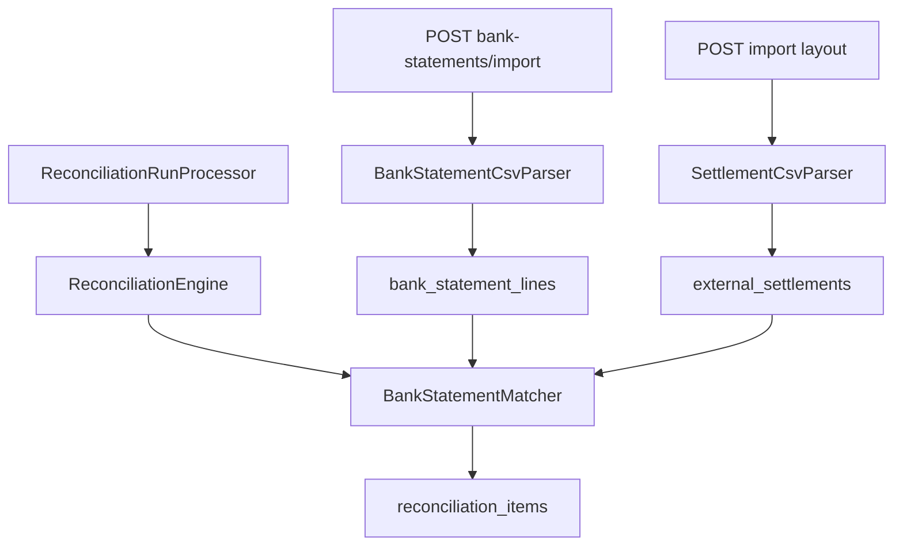

# Layouts and Statement Design

**Spec**: `.specs/features/layouts-and-statement/spec.md`
**Status**: Approved

---

## Architecture Overview

O CSV de liquidação ganha o parâmetro `layout`. As receitas `RECONPAY` e `ACQUIRER` só trocam o cabeçalho. A validação de cada linha continua a do parser atual. O extrato é um cadastro novo, no mesmo formato de lote. O motor que cruza venda e liquidação não muda. Dentro da mesma transação do run, um passo seguinte casa as linhas do banco e grava a divergência no item, antes da contagem e do commit.



---

## Code Reuse Analysis

### Existing Components to Leverage

| Component | Location | How to Use |
| --------- | -------- | ---------- |
| SettlementCsvParser | `externalsettlement/service/SettlementCsvParser.java` | Continua validando a linha. Passa a receber o cabeçalho da receita |
| ExternalSettlementService | `externalsettlement/service/ExternalSettlementService.java` | Mesmo fluxo de lote, duplicidade e auditoria depois do commit |
| InvalidSettlementImportException e SettlementImportValidationException | `exception/` | O extrato lança as mesmas exceções. O HTTP 400 já está mapeado |
| DuplicateExternalSettlementException | `exception/DuplicateExternalSettlementException.java` | O extrato reusa a exceção para o HTTP 409 com referências conflitantes |
| DataIntegrityViolationException | `exception/handler/GlobalExceptionHandler.java` | O índice único do extrato cai no 409 que já existe para corrida |
| MerchantAccessAspect | `security/MerchantAccessAspect.java` | O controller novo fica coberto porque o parâmetro se chama `merchantId` |
| AuditLogger | `observability/AuditLogger.java` | `BANK_STATEMENTS_IMPORTED` registrado em `afterCommit` |
| ReconciliationEngine | `reconciliation/service/ReconciliationEngine.java` | Segue produzindo só venda contra liquidação |
| ReconciliationRunProcessor | `reconciliation/service/ReconciliationRunProcessor.java` | Chama o matcher depois do motor e antes de `persistInBatches` |
| ReconciliationCsvExporter | `reconciliation/service/ReconciliationCsvExporter.java` | Não ganha coluna. O tipo novo aparece em `discrepancyTypes` |
| DiscrepancyResolutionService | `reconciliation/service/DiscrepancyResolutionService.java` | Não filtra por tipo. A divergência de banco nasce `OPEN` e aceita o PATCH atual |

### Integration Points

| System | Integration Method |
| ------ | ------------------ |
| Import de liquidação | `POST /api/merchants/{merchantId}/external-settlements/import` ganha `layout` opcional |
| Import de extrato | `POST` e `GET /api/merchants/{merchantId}/bank-statements` |
| Run | O processor lê `bank_statement_lines` na janela estendida e altera a lista de itens em memória |
| PostgreSQL | Flyway `V21`. Sem `ddl-auto` |

---

## Components

### SettlementLayout

- **Purpose**: Nomear as duas receitas e o cabeçalho de cada uma.
- **Location**: `externalsettlement/enums/SettlementLayout.java`
- **Interfaces**:
  - `RECONPAY` cabeçalho `externalReference,amount,netAmount,paymentMethod,installments,status,settlementDate`
  - `ACQUIRER` cabeçalho `nsu,valor_bruto,valor_liquido,forma_pagamento,parcelas,situacao,data_liquidacao`
  - `header(): String[]`
- **Dependencies**: nenhuma
- **Reuses**: a ordem semântica das sete colunas atuais

### SettlementCsvParser

- **Purpose**: Validar o arquivo da receita escolhida e devolver as linhas já no formato interno.
- **Location**: `externalsettlement/service/SettlementCsvParser.java`
- **Interfaces**:
  - `parse(InputStream inputStream, SettlementLayout layout): List<ParsedSettlementRow>`
- **Dependencies**: `Clock`
- **Reuses**: `validateRow`. Os índices das colunas não mudam. Só o texto do cabeçalho muda

### ExternalSettlementController e Service

- **Purpose**: Aceitar a receita no mesmo envio do arquivo.
- **Location**: `externalsettlement/controller/ExternalSettlementController.java`, `externalsettlement/service/ExternalSettlementService.java`
- **Interfaces**:
  - `importCsv(UUID merchantId, MultipartFile file, SettlementLayout layout): SettlementImportResponseDTO`
  - `layout` ausente vale `RECONPAY`
- **Dependencies**: parser, repositórios, `AuditLogger`
- **Reuses**: lote, checagem de duplicidade e `SETTLEMENTS_IMPORTED`

### Bank statement

- **Purpose**: Gravar o extrato de um merchant, isolado, com lote rastreável.
- **Location**: `bankstatement/` (`controller`, `service`, `entity`, `repository`, `dto`, `mapper`)
- **Interfaces**:
  - `importCsv(UUID merchantId, MultipartFile file): BankStatementImportResponseDTO`
  - `findAll(UUID merchantId, UUID importId, Pageable pageable): Page<BankStatementLineResponseDTO>`
  - Parser exige o cabeçalho `lineReference,externalReference,amount,movementDate`
- **Dependencies**: `Clock`, `AuditLogger`, `IMerchantRepository`
- **Reuses**: o formato de `settlement_imports`, a validação de data e de dinheiro do parser de liquidação, e as exceções de importação já mapeadas

### BankStatementMatcher

- **Purpose**: Casar liquidações do run com linhas do extrato e anexar a divergência de banco.
- **Location**: `reconciliation/service/BankStatementMatcher.java`
- **Interfaces**:
  - `apply(List<ReconciliationItemEntity> items, List<BankStatementLineEntity> lines, Set<String> transactionReferencesOutsideWindow): List<ReconciliationItemEntity>`
- **Dependencies**: `ReconciliationProperties`
- **Reuses**: `ReconciliationItemEntity.addDiscrepancy`, `DiscrepancyStatus.OPEN`, a comparação `abs(difference) > amountTolerance`

### ReconciliationRunProcessor

- **Purpose**: Rodar o matcher na mesma transação do run, antes de persistir e de contar.
- **Location**: `reconciliation/service/ReconciliationRunProcessor.java`
- **Interfaces**: o `process(UUID runId)` existente passa a carregar as linhas e chamar o matcher entre `reconcile` e `persistInBatches`
- **Dependencies**: repositório de linhas do extrato, matcher
- **Reuses**: janela `toDate.plusDays(settlementLagDays)` e `findExistingReferences`

---

## Data Models

### SettlementLayout

```java
enum SettlementLayout {
    RECONPAY,
    ACQUIRER
}
```

**Relationships**: não persiste. Entra só no request.

### bank_statement_imports

```java
class BankStatementImportEntity {
    UUID id;
    MerchantEntity merchant;
    String fileName;
    Integer totalRows;
    Instant createdAt;
}
```

**Relationships**: um lote por envio, muitos para um merchant.

### bank_statement_lines

```java
class BankStatementLineEntity {
    UUID id;
    MerchantEntity merchant;
    BankStatementImportEntity importBatch;
    String lineReference;
    String externalReference;
    BigDecimal amount;
    LocalDate movementDate;
    Instant createdAt;
    Instant updatedAt;
}
```

**Relationships**: muitos para um lote e um merchant. `externalReference` nulo quando a coluna vem em branco.

Índice único `(merchant_id, line_reference)`. Índice `(merchant_id, movement_date)`. `amount > 0`. `total_rows > 0` no lote. `NUMERIC(19, 2)`.

### DiscrepancyType

Quatro valores novos, na coluna `VARCHAR(50)` que já existe. Sem migration de tipo.

- `BANK_AMOUNT_MISMATCH`
- `MISSING_BANK_CREDIT`
- `ORPHAN_BANK_CREDIT`
- `AMBIGUOUS_BANK_MATCH`

Valor gravado com escala 2 e `toPlainString`, igual ao motor. `BANK_AMOUNT_MISMATCH` usa o líquido da liquidação em `expectedValue` e o valor do banco em `actualValue`. `MISSING_BANK_CREDIT` grava o líquido e deixa `actualValue` nulo. `ORPHAN_BANK_CREDIT` deixa `expectedValue` nulo e grava o valor do banco. `AMBIGUOUS_BANK_MATCH` no item da liquidação grava o líquido e deixa o atual nulo. No item só do banco, deixa o esperado nulo e grava o valor do banco.

### Passos do matcher

1. Item com liquidação entra na disputa. Item sem liquidação não recebe tipo de banco.
2. Linha com código, sem liquidação desse código no run, e com transação só fora da janela: ignorada. Não vira item.
3. Passagem por código, antes do valor e da data. Código igual ao da liquidação e valor dentro da tolerância: par, sem divergência de banco. Código igual e valor fora: `BANK_AMOUNT_MISMATCH`. Os dois saem da passagem seguinte. A data não entra nesta passagem.
4. Linha sem código e liquidação ainda sem par. Elegível quando `movementDate` é igual a `settlementDate` e o valor está dentro da tolerância.
5. Há par só quando a liquidação tem uma linha elegível e essa linha tem uma liquidação elegível. Caso contrário ninguém é escolhido.
6. Liquidação sem linha elegível: `MISSING_BANK_CREDIT`. Com mais de uma, ou com a única linha também elegível para outra liquidação: `AMBIGUOUS_BANK_MATCH`.
7. Linha sem liquidação elegível: `ORPHAN_BANK_CREDIT`. Com mais de uma: `AMBIGUOUS_BANK_MATCH`.
8. Item só de banco usa `lineReference` como `external_reference`. Sem transação e sem liquidação. Resultado `DIVERGENT`.
9. Se já existe item com essa `lineReference` e esse item tem liquidação, a divergência de banco entra nele. Não nasce segunda linha.
10. Se já existe item com essa `lineReference` e esse item não tem liquidação, ele continua sem tipo de banco e a linha não vira outro item.
11. Depois de anexar, o resultado do item volta a ser `MATCHED` só se a lista de divergências ficou vazia.

---

## Error Handling Strategy

| Error Scenario | Handling | User Impact |
| -------------- | -------- | ----------- |
| `layout` desconhecido | Enum inválido cai no handler de argumento malformado | HTTP 400 `VALIDATION_ERROR`, nada gravado |
| Cabeçalho diferente da receita | `InvalidSettlementImportException` | HTTP 400, nada gravado |
| Linha inválida ou referência repetida no arquivo | `SettlementImportValidationException` | HTTP 400 com `rowErrors`, nada gravado |
| Referência já existente no merchant | `DuplicateExternalSettlementException` | HTTP 409 `CONFLICT`, nada gravado |
| Dois envios simultâneos da mesma referência | O índice único estoura `DataIntegrityViolationException` | HTTP 409, um dos envios permanece |
| Arquivo acima de 5 MB | Handler já existente | HTTP 413 |
| Sem arquivo ou sem `.csv` | Mesma validação do serviço de liquidação | HTTP 400 |
| Data futura ou dinheiro fora do teto | Erro de linha | HTTP 400 com `rowErrors` |
| Falha no meio do `saveAll` | A transação do serviço desfaz lote e linhas | Nenhum audit, porque o log sai no `afterCommit` |

---

## Risks & Concerns

| Concern | Location (file:line) | Impact | Mitigation |
| ------- | -------------------- | ------ | ---------- |
| Runs que hoje fecham `MATCHED` sem extrato passam a `DIVERGENT` | `reconciliation/service/ReconciliationEngine.java:58` | Testes de conciliação que esperam match só com venda e liquidação quebram | A tarefa do matcher atualiza essas asserções para `MISSING_BANK_CREDIT`. A asserção nova vem da spec, não de um teste enfraquecido |
| Parser com cabeçalho fixo | `externalsettlement/service/SettlementCsvParser.java:38` | Copiar a validação de dinheiro para a receita `ACQUIRER` faria as regras divergirem | `parse` recebe o cabeçalho. `validateRow` permanece o único lugar das regras de linha |
| Chave única do item | `db/migration/V12__reconciliation_item_integrity.sql:3` | `lineReference` igual à referência de um item que já tem liquidação não pode gerar outra linha | A divergência de banco entra nesse item. O teste cobre esse empate |
| Item sem liquidação e a mesma chave | `reconciliation/service/ReconciliationEngine.java:93` | A spec proíbe tipo de banco nesse item e o índice proíbe uma segunda linha com a mesma referência | O item da venda permanece sem tipo de banco e a linha não aparece no run. O teste afirma esse limite |
| Carga da janela inteira | `reconciliation/service/ReconciliationRunProcessor.java:123` | O extrato repete a leitura sem página que a liquidação já faz | Índice `(merchant_id, movement_date)`, o mesmo desenho de `idx_external_settlements_merchant_settlement_date` |
| Corrida check-then-act | `exception/handler/GlobalExceptionHandler.java:185` | Dois imports passam da checagem e um toma erro de índice | O extrato usa o mesmo handler. O teste de concorrência não é obrigatório se o índice e o handler já cobrem o 409 |

---

## Tech Decisions

| Decision | Choice | Rationale |
| -------- | ------ | --------- |
| Onde o banco entra no run | Segunda passada no processor | O motor segue recebendo só transação e liquidação |
| Onde a divergência mora | No item do run | A spec lê o run. Tabela de par fica para os indicadores |
| Pacote do extrato | `bankstatement` | O mesmo recorte de `externalsettlement` |
| Exceções do extrato | As de importação de liquidação | O contrato HTTP já está no handler |
| Migration | `V21__create_bank_statement_tables.sql` | A última aplicada é `V20` |
| Mapa de módulos | Incluir `bankstatement` em `AGENTS.md` | O mapa permanente lista os pacotes |

Nenhuma dessas escolhas vira `AD-NNN`. Elas valem para esta feature. Papéis, e-mail, auto-grant, owner e Resend continuam como estão em `.specs/STATE.md`.
