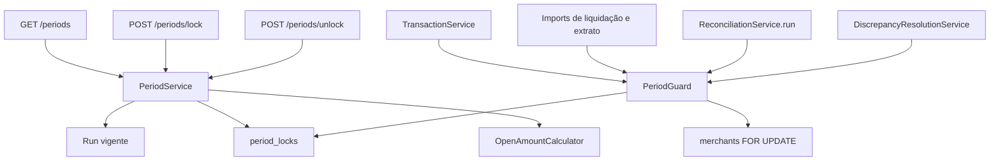

# Period Close Design

**Spec**: `.specs/features/period-close/spec.md`
**Status**: Approved

---

## Architecture Overview

A janela travada é uma linha em `period_locks`. Reabrir apaga a linha. O run vigente continua a fonte da taxa e das divergências. Um `PeriodGuard` segura a linha do merchant com `SELECT FOR UPDATE` e só então olha a trava. Transação, importação, o POST do run e o PATCH da divergência chamam esse guard dentro da transação que já gravam. GET, trava e reabertura devolvem o mesmo corpo.



---

## Code Reuse Analysis

### Existing Components to Leverage

| Component | Location | How to Use |
| --------- | -------- | ---------- |
| Run vigente | `reconciliation/repository/IReconciliationRunRepository.java` | O índice `uk_reconciliation_runs_current_window` já garante um `COMPLETED` com `supersededAt` nulo por janela |
| Run em andamento | `db/migration/V15__reconciliation_run_status.sql` | `PENDING` e `RUNNING` já são únicos por janela. A leitura e a trava recusam a janela quando essa linha existe |
| `InvalidReconciliationWindowException` | `exception/InvalidReconciliationWindowException.java` | Data invertida e janela acima de `maxWindowDays` continuam HTTP 400 `VALIDATION_ERROR` |
| `MerchantNotFoundException` | `exception/MerchantNotFoundException.java` | Merchant inativo ou inexistente continua HTTP 404 |
| `MerchantAccessAspect` | `security/MerchantAccessAspect.java` | O parâmetro `merchantId` cobre GET, lock e unlock sem check manual |
| `AuditLogger` | `observability/AuditLogger.java` | `PERIOD_LOCKED` e `PERIOD_UNLOCKED` saem no `afterCommit` |
| `Clock` | `config/TimeConfig.java` | `lockedAt` usa o mesmo relógio do `finishedAt` |
| `DataIntegrityViolationException` | `exception/handler/GlobalExceptionHandler.java` | O índice único da trava continua caindo no HTTP 409 que já existe |
| `RunReconciliationRequestDTO` | `reconciliation/dto/RunReconciliationRequestDTO.java` | O corpo da trava repete `@NotNull` e o intervalo. Não reusa o tipo, para o schema do período não seguir o texto do run |
| Interface `*Api` | `reconciliation/openapi/ReconciliationControllerApi.java` | AD-006. O controller não leva `@Operation` nem mapping |

### Integration Points

| System | Integration Method |
| ------ | ------------------ |
| Período | `GET /api/merchants/{merchantId}/periods` e `POST .../periods/lock` e `POST .../periods/unlock` |
| Conciliação | `ReconciliationService.run` recusa a janela exata já travada, antes do `saveAndFlush` |
| Divergência | `DiscrepancyResolutionService.changeStatus` recusa o PATCH do run vigente da janela travada, depois da validação que já existe |
| Transação | `create` e `updateStatus` recusam a data coberta, depois das regras que já devolvem 400 ou 409 |
| Importação | Liquidação e extrato recusam o lote se qualquer data válida cair numa trava, depois do parse e da duplicidade |
| PostgreSQL | Flyway `V22__create_period_locks.sql`. Sem `ddl-auto` |
| Segurança | `SecurityConfig` ganha o matcher de `/periods`, no mesmo papel de `/reconciliations` |
| OpenAPI | Tag `Reconciliations`. Sem tag nova |

---

## Components

### PeriodLockEntity

- **Purpose**: Guardar a trava atual de uma janela.
- **Location**: `reconciliation/entity/PeriodLockEntity.java`
- **Interfaces**: `id`, `merchant`, `fromDate`, `toDate`, `run`, `lockedAt`
- **Dependencies**: `MerchantEntity`, `ReconciliationRunEntity`
- **Reuses**: UUID gerado, como o run

### IPeriodLockRepository

- **Purpose**: Achar a trava exata e listar as travas vivas do merchant.
- **Location**: `reconciliation/repository/IPeriodLockRepository.java`
- **Interfaces**:
  - `findByMerchant_IdAndFromDateAndToDate(merchantId, fromDate, toDate): Optional<PeriodLockEntity>`
  - `findByMerchant_Id(merchantId): List<PeriodLockEntity>`
- **Dependencies**: JPA
- **Reuses**: o estilo de `IReconciliationRunRepository`

### PeriodGuard

- **Purpose**: Ser o único lugar que segura o merchant e decide se a data ou a janela estão travadas.
- **Location**: `reconciliation/service/PeriodGuard.java`
- **Interfaces**:
  - `lockMerchant(merchantId): MerchantEntity` — `PESSIMISTIC_WRITE` em merchant ativo. Ausente: `MerchantNotFoundException`
  - `assertWindowOpen(merchantId, fromDate, toDate): void` — chama `lockMerchant`. Linha exata existente: `PeriodConflictException`
  - `assertDatesOpen(merchantId, dates): void` — chama `lockMerchant`. Uma data dentro de qualquer trava do merchant, inclusive os extremos: `PeriodConflictException`
- **Dependencies**: `IMerchantRepository`, `IPeriodLockRepository`
- **Reuses**: a lista de travas do merchant cabe em memória. Reabrir apaga a linha, então a lista é só o que está fechado agora

### OpenAmountCalculator

- **Purpose**: Somar o dinheiro das divergências `OPEN` do run.
- **Location**: `reconciliation/service/OpenAmountCalculator.java`
- **Interfaces**:
  - `sum(discrepancies): BigDecimal` — escala 2, `HALF_UP`
- **Dependencies**: nenhuma
- **Reuses**: os decimais do snapshot no item. O valor do extrato sai de `actualValue`, que o matcher já grava com `setScale(2).toPlainString()`

A soma, por divergência `OPEN`:

| Tipo | Parcela |
| ---- | ------- |
| `MISSING_SETTLEMENT` | `expectedNetAmount` |
| `ORPHAN_SETTLEMENT` | `settlementNetAmount` |
| `INCORRECT_AMOUNT` | diferença absoluta de `transactionAmount` e `settlementAmount` |
| `FEE_DIVERGENCE` | diferença absoluta de `expectedNetAmount` e `settlementNetAmount` |
| `MISSING_BANK_CREDIT` | `settlementNetAmount` |
| `BANK_AMOUNT_MISMATCH` | diferença absoluta de `settlementNetAmount` e do valor do extrato |
| `ORPHAN_BANK_CREDIT` | valor do extrato |
| `STATUS_MISMATCH`, `PAYMENT_METHOD_MISMATCH`, `INSTALLMENTS_MISMATCH`, `AMBIGUOUS_BANK_MATCH` | `0.00` |

Valor nulo vira `0.00` antes da diferença. Outro status não entra. O valor do extrato é `actualValue`: vazio vira `0.00`; preenchido é `new BigDecimal(actualValue)`.

### PeriodService

- **Purpose**: Ler, travar e reabrir a janela, e montar o corpo único.
- **Location**: `reconciliation/service/PeriodService.java`
- **Interfaces**:
  - `get(merchantId, fromDate, toDate): PeriodResponseDTO`
  - `lock(merchantId, fromDate, toDate): PeriodResponseDTO`
  - `unlock(merchantId, fromDate, toDate): PeriodResponseDTO`
- **Dependencies**: `PeriodGuard`, `OpenAmountCalculator`, `IReconciliationRunRepository`, `IPeriodLockRepository`, `IReconciliationDiscrepancyRepository`, `ReconciliationProperties`, `AuditLogger`, `Clock`
- **Reuses**: a fórmula de dias de `ReconciliationService.ensureWindowIsWithinLimit`. As quatro linhas ficam repetidas aqui e lançam `InvalidReconciliationWindowException`. Sem extrair método do serviço de run

Ordem do GET, sem lock de linha:

1. Janela inválida ou acima de `maxWindowDays`: 400.
2. Merchant inativo: 404.
3. Existe `PENDING` ou `RUNNING` na mesma janela: 409.
4. Não existe `COMPLETED` com `supersededAt` nulo: 404.
5. Monta o corpo. Um `FAILED` mais novo não entra nessa busca.

Ordem da trava, na mesma transação:

1. Janela inválida: 400, antes do lock de linha.
2. `lockMerchant`.
3. Linha de trava já existe: 409, `lockedAt` permanece.
4. Existe `PENDING` ou `RUNNING`: 409, nada gravado.
5. Não existe run vigente: 404, nada gravado.
6. Existe divergência `OPEN` nesse run: 409, nada gravado.
7. Insere a linha com o `runId` vigente e `lockedAt = clock.instant()`.
8. `PERIOD_LOCKED` depois do flush, com merchant, janela e runId.

Ordem da reabertura:

1. Janela inválida: 400.
2. `lockMerchant`.
3. Sem linha: 409.
4. Apaga a linha. `PERIOD_UNLOCKED` depois do flush.
5. Devolve o corpo com `locked` false e duração nula. `runId` e `matchRate` são os do mesmo run.

`matchRate` é `matchedCount / totalItems`, escala 4, `HALF_UP`. `totalItems` zero produz null. `closeDurationSeconds` é `Duration.between(finishedAt, lockedAt).toSeconds()`. Sem trava, null.

### PeriodController e PeriodControllerApi

- **Purpose**: Publicar os três endpoints.
- **Location**: `reconciliation/controller/PeriodController.java`, `reconciliation/openapi/PeriodControllerApi.java`
- **Interfaces**:
  - `GET /api/merchants/{merchantId}/periods?fromDate&toDate`
  - `POST /api/merchants/{merchantId}/periods/lock`
  - `POST /api/merchants/{merchantId}/periods/unlock`
- **Dependencies**: `PeriodService`
- **Reuses**: AD-006. Tag `Reconciliations`. Corpo `PeriodWindowRequestDTO` com `fromDate` e `toDate` obrigatórios e `fromDate <= toDate`

`PeriodResponseDTO` leva, nesta ordem: `runId`, `fromDate`, `toDate`, `totalItems`, `matchedCount`, `divergentCount`, `matchRate`, `openAmount`, `locked`, `lockedAt`, `closeDurationSeconds`. `matchRate`, `lockedAt` e `closeDurationSeconds` são nulos quando a spec manda ausente. `BigDecimal` preserva a escala no JSON.

### Exceções

- **Purpose**: Separar 404 e 409 do período das exceções de divergência.
- **Location**: `exception/PeriodNotFoundException.java`, `exception/PeriodConflictException.java`
- **Interfaces**: as duas entram nas listas que já existem em `GlobalExceptionHandler`
- **Dependencies**: nenhuma
- **Reuses**: `NOT_FOUND` e `CONFLICT`

### Ganchos nas escritas

- **Purpose**: A trava valer nos quatro pontos que mudam a janela.
- **Location**: os serviços já citados
- **Interfaces**: cada um chama o guard dentro do `@Transactional` que já possui, depois da validação atual e antes do `save`
- **Dependencies**: `PeriodGuard`
- **Reuses**: o código HTTP que cada validação já devolve. Duplicidade, taxa ausente e transição inválida continuam com o status de hoje. A trava só é consultada quando essa escrita seguiria em frente

O processor do run não ganha checagem. O POST é recusado com a janela travada, e a trava é recusada com run `PENDING` ou `RUNNING`. Os dois passam pelo mesmo lock da linha do merchant.

### SecurityConfig

- **Purpose**: Exigir `ADMIN` ou `OPERATOR` no caminho novo.
- **Location**: `config/SecurityConfig.java`
- **Interfaces**: matcher `/api/merchants/*/periods` e `/api/merchants/*/periods/**`
- **Dependencies**: nenhuma
- **Reuses**: o matcher de `/reconciliations`. O aspect continua responsável pelo grant

---

## Data Models

### period_locks

```sql
CREATE TABLE period_locks (
    id UUID PRIMARY KEY,
    merchant_id UUID NOT NULL REFERENCES merchants (id),
    from_date DATE NOT NULL,
    to_date DATE NOT NULL,
    run_id UUID NOT NULL REFERENCES reconciliation_runs (id),
    locked_at TIMESTAMP NOT NULL,
    CONSTRAINT uk_period_locks_window UNIQUE (merchant_id, from_date, to_date)
);
```

**Relationships**: uma linha por janela travada. O `run_id` é o vigente no momento da trava. Reabrir apaga a linha. Não há `locked_by`. O ator fica no audit log.

A cobertura de data é `from_date <= data` e `to_date >= data`, lida da lista do merchant depois do `FOR UPDATE`. O índice único já serve a busca da janela exata e o backstop da corrida.

---

## Error Handling Strategy

| Error Scenario | Handling | User Impact |
| -------------- | -------- | ----------- |
| `fromDate` ou `toDate` ausente | Bean validation no POST. Query param ausente no GET | HTTP 400 `VALIDATION_ERROR` |
| `fromDate` depois de `toDate`, ou janela maior que `maxWindowDays` | `InvalidReconciliationWindowException` | HTTP 400 `VALIDATION_ERROR` |
| Merchant inativo ou inexistente | `MerchantNotFoundException` | HTTP 404 `NOT_FOUND` |
| Sem run `COMPLETED` vigente | `PeriodNotFoundException` | HTTP 404 `NOT_FOUND`, sem linha de trava |
| `PENDING` ou `RUNNING` na janela | `PeriodConflictException` | HTTP 409 `CONFLICT` |
| Divergência `OPEN` na trava | `PeriodConflictException` | HTTP 409, janela segue aberta |
| Travar de novo ou reabrir o que está aberto | `PeriodConflictException` | HTTP 409, `lockedAt` original permanece na segunda trava |
| Data ou janela travada numa escrita | `PeriodConflictException` | HTTP 409, nada dessa escrita é gravado |
| Payload que hoje já falha | A exceção atual, antes do guard | O mesmo 400 ou 409 de hoje, mesmo com data também travada |
| Duas travas ao mesmo tempo | A segunda espera o `FOR UPDATE`. A linha já existe | HTTP 409. O índice único repete o 409 se o lock de linha faltar |
| Falha ao inserir a trava | Rollback | Janela aberta, sem `PERIOD_LOCKED` |
| Sem token | Entry point já existente | HTTP 401 |
| OPERATOR sem grant | `MerchantAccessAspect` | HTTP 403 `FORBIDDEN` |

---

## Risks & Concerns

| Concern | Location (file:line) | Impact | Mitigation |
| ------- | -------------------- | ------ | ---------- |
| POST do run grava `PENDING` sem olhar trava | `reconciliation/service/ReconciliationService.java:81` | Uma trava e um run novo da mesma janela podem os dois persistir | `assertWindowOpen` antes do `saveAndFlush`, com o merchant travado até o commit |
| Check-then-act em `READ COMMITTED` | `exception/handler/GlobalExceptionHandler.java:190` | Duas transações leem "sem trava" e as duas gravam | `PESSIMISTIC_WRITE` na linha do merchant dentro da mesma transação. O único `(merchant_id, from_date, to_date)` é o backstop e já vira 409 |
| Valor do extrato só existe como texto | `reconciliation/service/BankStatementMatcher.java:225` | Somar a coluna errada muda `openAmount` | A calculadora lê `actualValue` só em `BANK_AMOUNT_MISMATCH` e `ORPHAN_BANK_CREDIT`. O teste passa pelo matcher, que grava a escala 2 |
| Catálogo OpenAPI fixo em nove controllers | `openapi/ApiDocumentationInterfacesTest.java:27` | O controller novo escapa da regra do `*Api` | A lista passa a incluir `PeriodController`. O teste de `/v3/api-docs` ganha as três operações, na tag `Reconciliations` |
| `SecurityConfig` não nomeia todo caminho de merchant | `config/SecurityConfig.java:82` | `/periods` cairia em `anyRequest().authenticated()` | Matcher explícito com `ADMIN` e `OPERATOR`, como `/reconciliations`. O buraco do extrato fica como está |
| Pacote `transaction` passa a ver `reconciliation` | `reconciliation/service/ReconciliationRunProcessor.java:17` | O processor já importa transação. O guard faz o caminho inverso | Só `PeriodGuard` atravessa. Sem pacote novo e sem ciclo além dessa chamada |
| Carga das divergências `OPEN` do run | `reconciliation/service/ReconciliationRunProcessor.java:115` | Um GET que lazy-load item por divergência vira N+1 | Uma consulta com join no item. A janela já é limitada por `maxWindowDays` |

---

## Tech Decisions

| Decision | Choice | Rationale |
| -------- | ------ | --------- |
| Onde a trava mora | Tabela `period_locks`, apagada na reabertura | A trava é da janela. O run continua só o resultado |
| Corrida | `FOR UPDATE` no merchant, índice único como rede | O projeto já transforma violação de único em 409. Não usa `SERIALIZABLE` |
| Onde o guard mora | `reconciliation.service.PeriodGuard` | A regra é da janela de conciliação. Os escritores chamam um tipo só |
| Valor em aberto | Snapshot do item, mais `actualValue` nos dois tipos de extrato | A spec pede o líquido e o valor do banco. Não há coluna decimal de extrato no item |
| Checagem de dias | Repetida no `PeriodService` | Evita abrir o método privado do run por quatro linhas |
| Tag OpenAPI | `Reconciliations` | Não muda a ordem das nove tags |
| Migration | `V22__create_period_locks.sql` | A última aplicada é `V21` |

Nenhuma dessas escolhas vira `AD-NNN`. Elas valem para esta feature. Papéis, e-mail, auto-grant, owner, Resend e o `*Api` continuam como estão em `.specs/STATE.md`.
